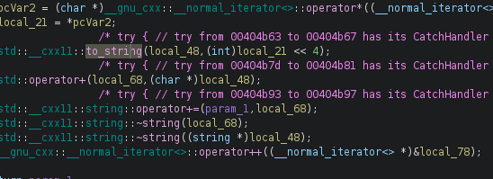
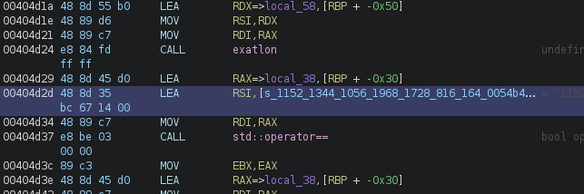
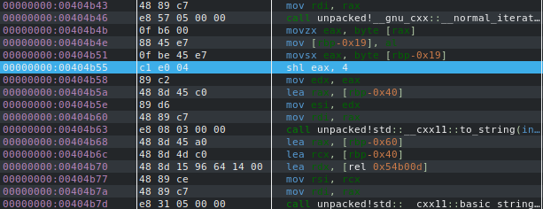

# Exatlon - Reverse Engineering Writeup

**Author:** Empty(0mpty) 
**Date:** 22.06.2026 
**Difficulty:** Easy 
**Category:** Reverse Engineering

---

## Tools Used

- Ghidra — static analysis
- edb (or gdb) — debugging
- UPX

---

## Description

We are given a binary file that has been packed with UPX. After unpacking, we discover it asks for a password and upon successful authentication, prints the flag. 
The binary uses a custom encryption algorithm based on bit shifting to validate the password.

---

## 1. Initial Analysis - Unpacking UPX

The first challenge is that the binary is packed with UPX.
After unpacking, the binary becomes much more readable in Ghidra.

---

## 2. Static Analysis with Ghidra

Opening the unpacked binary in Ghidra reveals an array of encrypted values that the input is compared against. However, the decompiler doesn't clearly show the encryption logic.

The encrypted values appear as:
``1152 1344 1056 1968 1728 816 1648 784 1584 816 1728 1520 1840 1664 784 1632 1856 1520 1728 816 1632 1856 1520 784 1760 1840 1824 816 1584 1856 784 1776 1760 528 528 2000``

Each number represents one encrypted character.

---

## 3. Dynamic Analysis with GDB

Since the decompiler doesn't clearly reveal the encryption logic, we use dynamic analysis. Setting breakpoints and analyzing registers during runtime reveals the key instruction:

``shl eax, 4``

This indicates that each character is being shifted left by 4 bits (multiplied by 16).

---

## 4. Understanding the Encryption

The encryption algorithm works as follows.

For example:

    'H' = 0x48 = 72 → 72 * 16 = 1152 ✓

    'T' = 0x54 = 84 → 84 * 16 = 1344 ✓

    'B' = 0x42 = 66 → 66 * 16 = 1056 ✓

    '{' = 0x7B = 123 → 123 * 16 = 1968 ✓

---

## 5. Decryption Script

The decryption algorithm is implemented in exatlon_v1_script.py.
