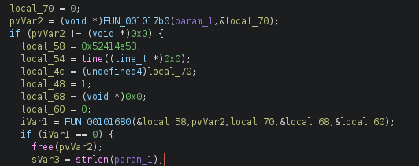
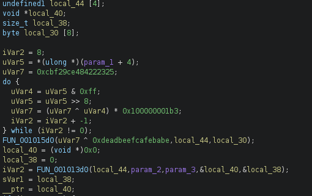
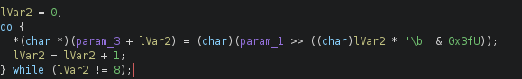
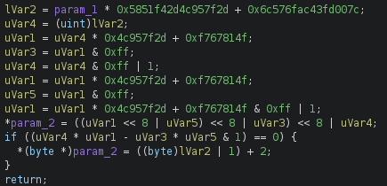
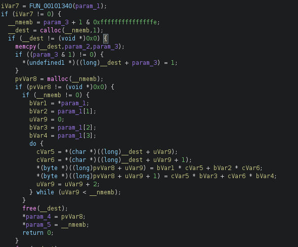
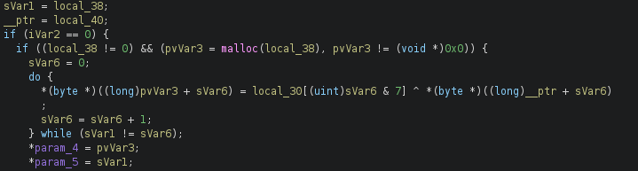

# HILLarious - Reverse Engineering Writeup

**Author:** Empty(0mpty)
**Date:** 28.08.2026
**Difficulty:** Medium
**Category:** Reversing

---

## Tools Used

- Ghidra — static analysis and decompilation
- EDB — debugging
- Python — write script for beginning
- C++ — write a decoder

---

## Description

We have a encrypter and we must create a decrypter.

---

## 1. Initial Analysis (Ghidra)

Opening the encrypter in Ghidra, we see how the encrypter check the input command is correct. Passing the check you are in the main function.

We see two function: `FUN_001017b0` and `FUN_00101680`. The function `FUN_001017b0` just take a text and write in `pvVar2(local_70 = text length)`. The function `FUN_00101680` decrypt text. We also have `local_70 - lenght of text`, `local_58 - main constant` and `local_54 - time`(Do not forget the local_54. We need it in neer future!!!).

---

## 2. Getting the first array

We follow to the `FUN_00101680` and we see two functions: `FUN_001015d0` and `FUN_001013d0`. You might spot two arrays: `local_44(length is 4)` and `local_30(length is 8)`. That arrays are the most important, because the encrypter will use that for encrypting a text.

To get the first array we get `uVar5`, `uVar7` and do some operations. `uVar7` is a constant, `uVar5`? What is it? Decompiler just takes `param_1(0x52414e53)` and plus `4`, but why? I will say that the author of the encrypter call the `local_54` using a special method. He called the `local_54` using `neer object(local_58)`. `local_54 = local_58 + 4`. `uVar5` is a time!!!(You can check it using a debugger). When we get an updated uVar7, we follow to `FUN_001015d0`.

There we fill `the first array(local_30)`.

---

## 3. Getting the second array

There we see some operations using the updated `uVar7`. The second array will fill in the function end.

---

## 4. The first part of main encrypting

Next we follow to `FUN_001013d0`. There we see the `FUN_00101340`. This function just checkes local_44 is correct. We scroll down and see encrypting algorithm.

Remember that: `__nmemb is lenght of text`, `__dest is a characters array(every elements are character of text. Encrypter use memcpy to fill the __dest)`, 
`pvVar8 is an array`

You must spot that before we append result in the `pvVar8` we get the byte(0xff) or character.

---

## 5. The second part of main encrypting

There is the last part of encrypting algorithm. We create an empty array `pvVar3` and fill it. We get element of `local_30` and XOR with `pvVar8(__ptr = pvVar8)`. 

---

## 6. Finish

The encrypter gets 0x14 byte(SNAR + Stack trash + encrypted text). When you write a decrypter, simply ignor this.
And..... Finish!!! That is all!! I hope my write up helps you solve this problem.

---

## 7. Mydecoders

I write a decoder using C++. Decoder name is `DeHill`. `Usage: ./DeHill decode <YourFileName>`. Also I write a python script `ransom_script.py`. A python script work, but it may contain errors!
