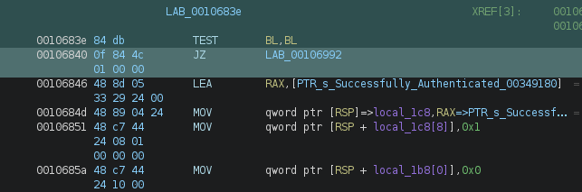
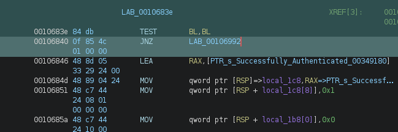
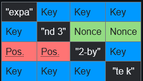
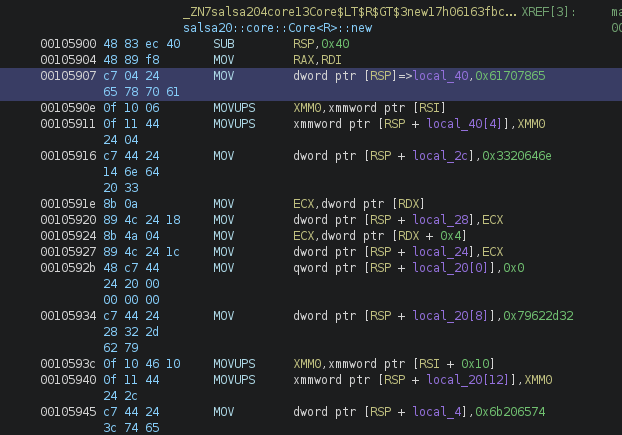
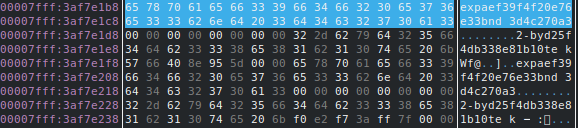
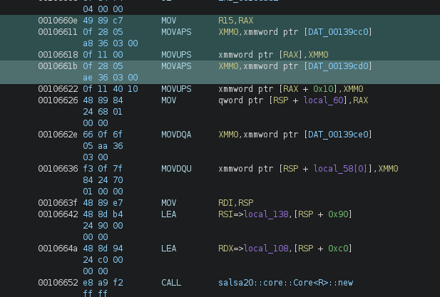

# RAuth - Reverse Engineering Writeup

**Author:** Empty(0mpty)
**Date:** 19.06.2026
**Difficulty:** Easy
**Category:** Reverse Engineering

---

## Tools Used

- Ghidra — static analysis
- edb (or gdb) — debugging
- netcat — remote connection

---

## Description

We are given a binary file that asks for a password and, upon successful authentication, prints the flag. The goal is to find the correct password and retrieve the flag.

---

## 1. Initial Analysis (Ghidra)

Open the binary in Ghidra. In the strings list, we see the following prompts:
Welcome to secure login portal!
Enter the password to access the system:
Successfully Authenticated
Flag:

Searching for the password check logic leads to a `test BL, BL` instruction followed by a conditional jump to success or failure.



---

## 2. Patching (Bypassing the Check)

We patch the conditional jump (`jz`/`jnz`) to force success. After patching, the program outputs:
HTB{F4k3_f74g_4_t3s7ing}

This is a **fake flag** placed by the author to mislead anyone who stops at simple patching.



---

## 3. Identifying the Algorithm

In the binary, we find the following constants inside the `salsa20::core::Core<R>::new` function:
0x61707865, 0x3320646e, 0x79622d32, 0x6b206574

These are the Salsa20/20 initialization constants, which form the string `"expand 32-byte k"` when interpreted as ASCII bytes in little-endian order.

Salsa20 uses an internal 4x4 matrix of 32-bit words. The initial state is constructed as follows:



We know that the matrix should begin with these constants (`"expa"`, `"nd 3"`, `"-byt"`, `"e k"`), so we search for this signature in memory.



---

## 4. Extracting the Key via Debugger (edb)

We run the binary in `edb` and set a breakpoint after the Salsa20 state is initialized, before the encryption rounds.

In memory, we locate the `"expa"` signature and extract the surrounding data. The full 32-byte key and 8-byte nonce are found adjacent to these constants.

The extracted key is:
ef39f4f20e76e33bd25f4db338e81b10te

The extracted nonce is:
d4c270a3



---
## 5. Extracting the Encrypted Data

Before the `salsa20::core::Core<R>::new` function, we locate the encrypted data that is passed to the keystream function. This data is stored in memory and later XORed with the Salsa20 keystream to produce the flag.

We extract the raw encrypted bytes from the binary.



---

## 6. Decrypting the Flag with Python

We write a Python script `rauth_script.py` that uses the extracted key and nonce to decrypt the encrypted data using Salsa20.
Password: `TheCrucialRustEngineering@2021;)`

---

## 7. Testing on the HTB Server

We connect to the remote server:

```bash
nc 154.57.164.83 31770
Enter the password:
TheCrucialRustEngineering@2021;)
Successfully Authenticated
Flag: HTB{...}
