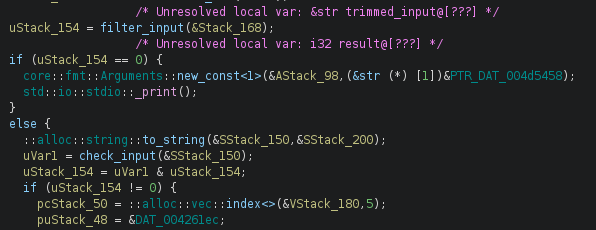
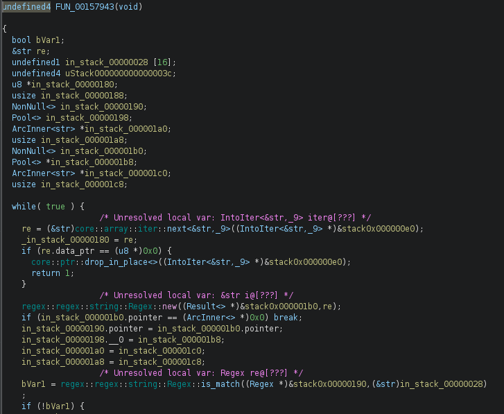
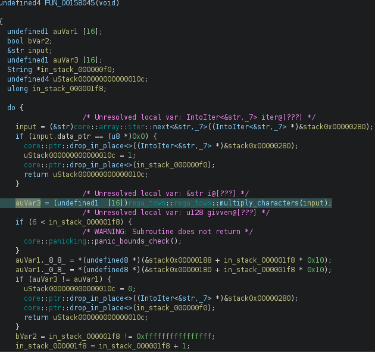
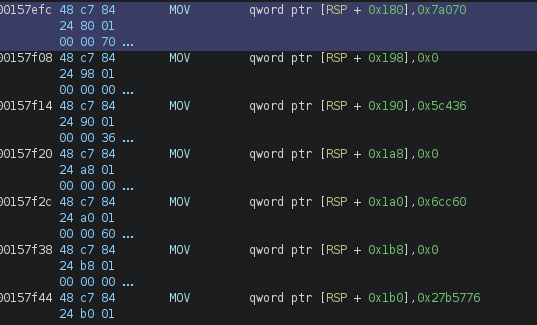
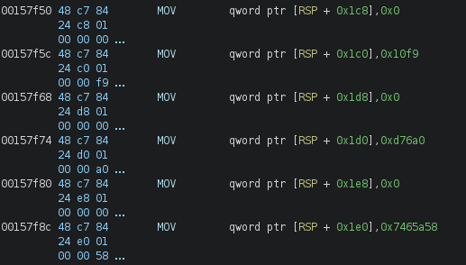

# Rega's Town - Reverse Engineering Writeup

**Author:** Empty(0mpty)
**Date:** 04.07.2026
**Difficulty:** Medium
**Category:** Reversing

---

## Tools Used

- Ghidra — static analysis and decompilation
- GDB (or edb) — debugging
- Python — brute-force script for password recovery

---

## Description

The binary implements a password validation system with a complex regex-based filter and arithmetic checks. The goal is to reconstruct the correct password, which itself is the flag.

---

## 1. Initial Analysis (Ghidra)

Opening the binary in Ghidra, we locate the `rega_town::rega_town::main` function. The program contains two main validation stages:

- filter_input — applies a regex pattern to the input
- check_input — performs arithmetic validation on individual parts

Both functions contain compiler optimization traps that obscure the actual logic. When analyzing `filter_input`, the decompiler shows a `memcpy` operation followed by nothing — this is a red herring.

---

## 2. Finding the Hidden Functions

Scrolling down in the decompiled output, we find the actual validation logic that was `hidden` by the compiler. The optimization removed visible function calls, but the code is still present in the binary.

---

## 3. The Regex Pattern

The filter_input function contains the following regex pattern:
``^.{33}$(?:^[\x48][\x54][\x42]).*^.{3}(\x7b).*(\x7d)$^[[:upper:]]{3}.[[:upper:]].{3}[[:upper:]].{3}[[:upper:]].{3}[[:upper:]].{4}[[:upper:]].{2}[[:upper:]].{3}[[:upper:]].{4}$(?:.*\x5f.*)(?:.[^0-9]*\d.*){5}.{24}\x54.\x65.\x54.*^.{4}[X-Z]\d._[A]\D\d.................[[:upper:]][n-x]{2}[n|c].$.{11}_T[h|7]\d_[[:upper:]]\dn[a-h]_[O]\d_[[:alpha:]]{3}_.{5}``

This pattern reveals the flag structure. Ignoring the constant parts HTB{ and }, we can break it into 7 variable parts:
``Flag format: HTB{part1_part2_part3_part4_part5_part6_part7}``

### Part 1: [X-Z]\d.

    1st char: X, Y, or Z

    2nd char: any digit (0-9)

    3rd char: any character except newline

### Part 2: [A]\D\d

    1st char: strictly 'A'

    2nd char: any non-digit character

    3rd char: any digit (0-9)

### Part 3: T[h|7]\d

    1st char: strictly 'T'

    2nd char: 'h', '|', or '7'

    3rd char: any digit (0-9)

### Part 4: [[:upper:]]\dn[a-h]

    1st char: any uppercase letter (A-Z)

    2nd char: any digit (0-9)

    3rd char: strictly 'n'

    4th char: lowercase letter from a-h

### Part 5: [O]\d

    1st char: strictly 'O'

    2nd char: any digit (0-9)

### Part 6: \x54.\x65.\x54

    Forms the word "The" (T, e, T are fixed via hex codes, middle char determined by context)

### Part 7: T[n-x]{2}[n|c]

    1st char: strictly 'T'

    2nd & 3rd chars: lowercase letters from n-x (can repeat)

    4th char: 'n', 'c', or '|'

---

## 4. The Second Validation Layer

The `check_input` function splits the password into 7 parts based on the underscores. Each part undergoes character-by-character validation.

### Compiler Trap

Similar to `filter_input`, the decompiler shows incomplete code. Scrolling down reveals the actual validation logic where each character is processed through a `multiply_characters` function.

### Understanding multiply_characters

This function takes a string and returns the product of ASCII values of all characters:
``Example: "abc" → ASCII(a) * ASCII(b) * ASCII(c) = 97 * 98 * 99``

The result is stored in auVar3 and compared against a reference value auVar1.

### Finding the Hidden Constants

The decompiler shows auVar1 = &stack0x00000180 but this location doesn't exist in the decompiled view due to analysis errors. We must examine the raw assembly:

In the assembly, we find:
``mov qword ptr [rsp + 0x180], 0x7a070``

Converting this to decimal:
``0x7a070 = 499824``

Therefore, the product of ASCII values for each part must equal 499824.

### Discovering Additional Constants

The validation checks are not limited to a single part. By analyzing the assembly further, we find a pattern of constants stored sequentially in memory.

The first constant is located at `[rsp + 0x180]` with value `0x7a070` (499824).

Subsequent constants are found by adding `0x10` to the previous address:

    [rsp + 0x180]  → 0x7a070 (499824)  - Part 1
    [rsp + 0x190]  → 0x?????           - Part 2
    [rsp + 0x1A0]  → 0x?????           - Part 3
    [rsp + 0x1B0]  → 0x?????           - Part 4
    [rsp + 0x1C0]  → 0x?????           - Part 5
    [rsp + 0x1D0]  → 0x?????           - Part 6
    [rsp + 0x1E0]  → 0x?????           - Part 7

Each part of the password must produce a product matching its corresponding constant. The values continue at `0x190`, `0x1A0`, and so on, until all parts are validated.

---

## 5. Password Recovery via Brute Force

I wrote a Python script rega_town_script.py that:

- Generates all possible combinations matching the regex pattern for each part
- Calculates the ASCII product for each generated string
- Finds combinations where the product equals the corresponding constant value
