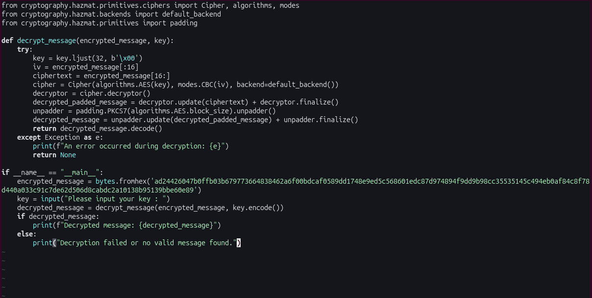
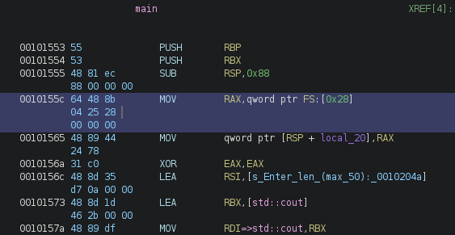
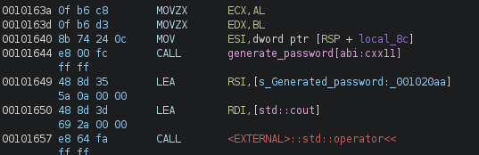
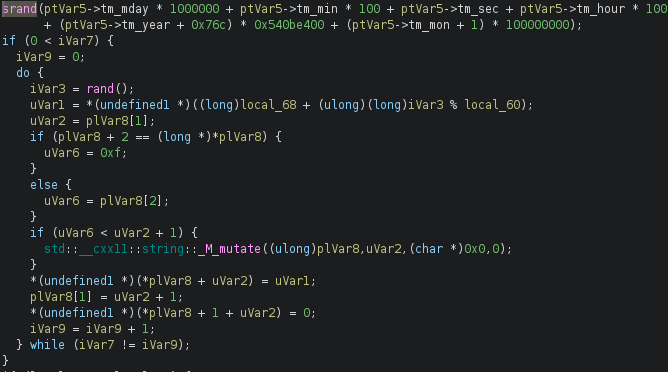
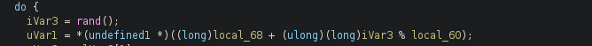

# Wayback - Reverse Engineering Writeup

**Author:** Empty(0mpty)
**Date:** 14.07.2026
**Difficulty:** Medium
**Category:** Reversing

---

## Tools Used

- Ghidra — static analysis and decompilation
- Python — key generation and brute-force script

---

## Description

The challenge provides two files: `decrypt.py` и `V1`. The decrypt.py script uses a generated key to decrypt a password (the flag). The `V1` binary generates these keys. The key we need was generated on either December 10, 2013, or December 11, 2013. Our goal is to understand the key generation mechanism in `V1` and reconstruct the correct key to decrypt the password.

---

## 1. Initial Analysis

### File Inspection

First, let's examine the file!
The `decrypt.py` script looks like this:

The `V1` binary generates a key string. We need to understand the algorithm to generate the correct key for the date.

---

## 2. Reverse Engineering V1 with Ghidra

Opening `V1` in Ghidra, we locate the `main` function. The decompiled code reveals the key generation process.
The decompiled `main` function shows:

### Finding the generate_password Function

Scrolling through the decompiled output, we find the `generate_password[abi::cxx11]` function. This is where the actual key generation logic resides.

The `generate_password` function contains the core logic:

### Key Observations

- Seed transformation: `seed(srand) = (tm_mday * 1000000 + tm_min * 100 + tm_sec + tm_hour * 10000 +  (tm_year - 1900 + 0x76c) * 0x540be400 + tm_mon * 100000000)`
- Function call: `main()` calls `generate_password[abi::cxx11]` to create the key
- Character set: `72` characters (0-9, A-Z, a-z, !@#$%^&*_+)
- Key length: `20` characters 
- Random generator: Uses `srand()` and `rand()` from `libc.so.6`

--- 

## 3. Analyzing the Random Number Generation

Looking deeper at the assembly, we can see how `rand()` is called and the modulo operation is performed.

---

## 4. Critical Insight: C vs Python Compatibility

The binary is compiled against `libc.so.6`. When generating the seed in Python, we must account for different time representations.

### The Year 1900 Issue

C's struct tm handles years differently, but more importantly, we need to ensure Python generates the exact same seed as the C binary would on the target date.

---

## 5. Implementing the Key Generator

### Understanding srand() and rand()

The C `rand()` function has a specific implementation in glibc. While Python's random module uses a different algorithm, we can:
- Use ctypes to call libc's `rand()` directly
- Reimplement the glibc PRNG in Python
- Use Python's random with the Random class and a compatible algorithm

For simplicity and accuracy, we'll use ctypes to call the system's `libc`.

My script `wayback_script.py`.

---

## 6. Brute-Force Approach

Since we know the key was generated on either December 10 or 11, 2013, we can write a script that:

- Generates keys for both dates
- Tries both keys with decrypt.py
- Checks if the decrypted output is readable
